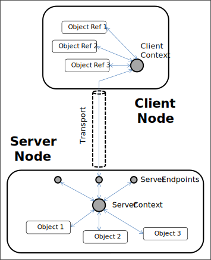

# Robot Raconteur Framework Architecture Standard

http://robotraconteur.com

http://github.com/robotraconteur

Copyright &copy; 2019 Wason Technology, LLC

*Robot Raconetur is a communication framework designed for use with robotics, automation, building control, and internet of things applications.*

## Abstract

At the highest level, Robot Raconteur is a communication framework designed to make communication between different parts of automated systems easier, more efficient, and more predictable. This framework consists of general concepts, and is independent of specific protocol or software implementations. This standard discusses the terminology, concepts, topology, and data model of the Robot Raconteur framework.

## Definitions

### Instance

A Robot Raconteur "Instance" is an independent collection of elements including a "Node", "Services", "Transports", "Service Types", and "Clients" that combined are able to communicate with other Robot Raconteur instances over a network or other communication technology. Note that a single device or a single program may contain one or multiple instances of Robot Raconteur, each of which operate and communicate independently.

### Node

A Robot Raconteur "Node" is the central management and communication point for each independent Robot Raconteur instance. Communication always begins and ends at a node, and all communication flows between nodes (or loopback to the same node). Nodes serve as the central connection point for the various components of a Robot Raconteur instance. Messages and other data flow between different elements within the instance of the node through the node.

### Message

Messages are universal data structures used to communicate operations and data between Robot Raconteur instances. These messages are "Packed" by the sender, "Serialized" by the "Transport", sent to the peer node by the "Transport", deserialized by the "Transport", and "Unpacked" by the receiver.

### Transport

A "Transport" is used to move messages from one node to another. The concept of a "Transport" is abstract, with the implementation details left to each transport option. Transports are expected to be "Reliable" with an option for lower qualities of service (QoS). ("Transports" are sometimes referred to as "Channels" in older documentation.)

### Reliable / Partial Reliable / Unreliable Transports

"Transports" are expected to be "Reliable", meaning that all messages are always completely delivered. If a delivery error occurs, the message must be resent or the connection must be closed with an error status. Transports may also provide a lower Quality of Service (QoS), meaning that not all messages are delivered. An "Unreliable" transport will only attempt to send a message once, and will ignore packets that don't arrive or arrive corrupted. "Partial Reliability" provides a QoS somewhere between "Reliable" and "Unreliable", meaning that some attempt will be made to resend messages that are not received correctly. **Messages must either be received completely or dropped. Reception of part of a message is invalid.**

### Endpoint

Connections between nodes have two "Endpoints" on either end of the connection. Endpoints are managed by nodes, and are used to send and receive messages between nodes.

### Thunk Code

Source code generated to implement "Packing" and "Unpacking" of messages for a "Service Type" for a specific computer language and Robot Raconteur implementation.

### Packing/Unpacking

"Messages" are used to transmit data between nodes using a universal data structure. Command and data need to be converted to and from system, computer language, and Robot Raconteur implementation specific formats to the universal message format. The conversion operations are referred to as "Packing" and "Unpacking" messages. This is typically accomplished automatically by scripting languages or using generated "Thunk" source code when compilation is necessary.

### Augmented Object-Oriented Model

Robot Raconteur extends the concepts of object oriented programming by introducing new object member types. These objects can have eight member types: `property`, `function`, `event`, `objref`, `pipe`, `callback`, `wire`, and `memory`.

### Service Definition

A Robot Raconteur "Service Definition" is a plain text Interface Definition Language (IDL) file that contains data types (`struct`, `pod`, `namedarray`), objects, exceptions, constants, and enums that can be used to interact with a service.

### Service Type

A "Service Type" is the instantiation of a "Service Definition" when used by a Robot Raconteur client or service. The "Service Type" includes a "Service Factory" that is used to manage the types defined in the "Service Definition".

### Service Factory

A "Service Factory" manages the types defined by a "Service Definition".

### Service

A service is a collection of objects that a a client can communicate with. The service is managed by a "Service Context" and communicate with clients through "Server Endpoints".

### Service Object

An object that exists within a service. A "Service Object" has a "Service Path" that is unique within the node.

### Server Context

The "Server Context" manages service objects, manages service skels manages sever endpoints, and interacts with the node.

### Server Endpoint

A "Server Endpoint" is a special endpoint that is used to represent a client connected to a "Service". Messages are send and received by the "Server Context" through "Server Endpoints".

### Client Connection

A "Client Connection" is an active connection to a "Service". "Client Connections" create "Object References" (sometimes called "Proxies") that allow the user to interact with the "Service Objects" of the connected "Service".

### Client Context

A "Client Context" is a special "Endpoint" that represents a "Client Connection". The "Client Context" manages "Object References" and manages communicating with the service.

### Service Skel

A "Service Skel" implements communication with a specific object type in a service. A "Service Skel" is considered "Thunk Code", and is typically generated from a "Service Definition" file or implemented automatically at runtime by a scripting language. A "Service Skel" sits between the "Server Context" and a "Service Object", translating "Messages" to type specific data/commands, and vice versa.

### Service Stub

A "Service Stub" implements a specific "Object Reference" type in a client. The "Service Stub" translates (packs) type specific data/commands to "Messages" and vice versa. Service stubs are managed by a "Client Context".

### Object Protocol

The Robot Raconteur "Object Protocol" is the protocol used to communicate RPC requests and packets between clients and services. The protocol is implemented using "Message" structures. (The "Object Protocol" only considers the contents of the message; it does not consider binary serialization.)

### Request

A request is an operation where a request formatted as a message is sent to the remote node, and a message is expected in response. For example, a function call is a request where a message containing the parameters and function name is sent to the remote node, the function is executed, and a message is returned with the result of the function. (Requests are sometimes referred to as "Transactions" in older documentation. They are now referred to as to "Requests" to avoid confusion with database transactional operations.) Requests can either be from client to service or service to client depending on the member type.

### Packet

A "Packet" is an operation where packet data is formatted as a message and sent to the remote node, but no message is expected in response. Examples of packets are Pipe and Wire data. Packets may flow from either client to service or service to client. Packets may have variable reliability depending on the QoS requested for the packet.

### Identifier

A 128-bit universally unique identifiers (UUID) and/or string to identify a node or other unique resource. This allows nodes and resources to be identified either by a UUID or a string. While the UUID portion of an identifier is guaranteed to be unique, the string portion may not be. The string portion is designed to be human readable and easy to use, while the UUID is intended for use when reliability is more important than ease of use.

### URL

A Robot Raconteur "URL" is a standard URL with a format that refers to a unique Robot Raconteur service.

### Value Type

Value types contains data, and is always passed between nodes by value. This means that they are effectively copied between nodes. Examples of value types include numbers, numeric arrays, strings, structures, pods, named arrays, and container types.

### Object Type

An object type contains members that can be used to interact with the object. Objects are always owned by a "Service", and can be utilized from a "Client Connection" using "Object References".

## Introduction

 Robot Raconteur is a communication framework designed to make communication between different parts of automated systems easier, more efficient, and more predictable. The framework is implemented using different programming, computing, and networking technologies depending on the application. At the highest level, Robot Raconteur is a standard framework that describes the concepts and components that make up a functioning Robot Raconteur instance and how they interact. This document provides an overview of this high level framework.

 The Robot Raconteur framework is designed to implement a client - service object-oriented Remote Procedure Call (RPC) system. The RPC concepts have been extended to cover the unique needs of robotics applications. These extensions include the Augmented Object-Oriented model, and the supported data types.

The above diagram shows the different elements that implement a client - service connection between two Robot Raconteur instances. 

 The details of the RPC interface and protocol are discussed in [Robot Raconteur Service Definition](service_definition.md) and [Robot Raconteur Object Protocol](object_protocol.md).

## Robot Raconteur Instance

 An "instance" of Robot Raconteur is an independent collection of elements including a "node", "services", "transports", "service types", and "clients" that combined are able to communicate with other Robot Raconteur instances over a network or other communication technology. The "node" is the central connection point for an instance, that manages the instance and connects the other components of the instance. A Robot Raconteur "instance" is often referred to as a Robot Raconteur "node", since each instance contains exactly one node.

## Robot Raconteur Node

 A "Robot Raconteur Node" is the central point in an "instance" of Robot Raconteur. The node connects all the various elements of the instance, and is capable of communicating with other nodes using "messages" transmitted over "transports". It manages "Client Connections" and "Services", allowing clients to communicate with services using messages.

### Node Identifiers

 Robot Raconteur Nodes use an "Identifiers" to uniquely identify nodes. A node identifier consists of a "NodeID", a 128 - bit universally unique identifier (UUID) and a "NodeName", a string representing the name.

* The "NodeID" shall be a UUID4 style random UUID, generated with sufficient entropy to guarantee uniqueness.
* The "NodeName" shall be an ASCII string containing segments consisting of US English letters, numbers, and underscores, separated by periods. Segments shall not start or end with an underscore, and shall not begin with a number. The name shall not begin or end with a period, and periods must be separated by segments. It is suggested that the reversed internet domain name be used when naming nodes, similar to Java package naming.

The "NodeID" shall be used to address a node whenever practical. The "NodeName" shall be used when a human-readable form of address is required.

The "NodeID" shall be static for server nodes so client nodes can find the node in the future. The "NodeID" may be randomly generated for clients when a node is initialized.

### Client Nodes and Server Nodes

The node can be configured to be a client (Client Node) if it will only be used to initiate connections, or can be a server (Server Node) if it can accept connections and exposes services. (A server instance that can also initiate connections is still called a "Server Node".)

## Endpoints

Connections to other nodes are formed by creating "endpoint" pairs through "transports". A message sent to an endpoint shall be transmitted to the remote endpoint, and vice versa. These endpoints will normally use "transports" to transmit messages, but this is not required. Endpoints are identified within a node with an unsigned 32 bit integer, unique to that endpoint within the instance. This is referred to as the "EndpointID". The combination of "NodeID" and "EndpointID" shall be unique within the life time of an instance. (Note that EndpointID will reset when a node is restarted).

* EndpointID shall be a 32 bit unsigned integer unique within the lifetime of an instance.

## Message

Messages are structures used to communicate between nodes using "Endpoints" and "Transports". A message passed to an endpoint shall be transmitted to the remote endpoint, usually by serializing the message and sending it over a network. A message consists of a "Message Header", followed by one or more "Message Entries". A "Message Header" has the following contents:

* Sender and Receiver NodeIDs and NodeNames for addressing
* Sender and Receiver EndpointIDs for routing messages
* Requested QoS (assumed reliable unless specified)
* Transport specific information

"Message Entries" contain a single request/response or packet. A "Message Entry" has the following contents:

* The EntryType, a numeric code for the type of entry (also referred to as an opcode)
* The ServicePath, a string representing the "Service Object" that the entry is associated with
* The MemberName, a string representing the member within the "Service Object" the entry is associated with
* The RequestID, a number used to match up a response message with the request
* Requested QoS for the message (assumed reliable unless specified)
* Data and parameters in the form of a list of "Message Elements"

"Message Elements" contain the data associated with the "Message Element". This data is arbitrary and depends on the purpose of the message. For instance, in a function call request the "Message Elements" contain the parameters, and in the response the "Message Elements" contain the return value. "Message Elements" can encode the following data types:

* Floating point arrays: `single` (32-bit floating point), `double` (64-bit floating point)
* Integer arrays: `int8`, `int16`, `int32`, `int64`
* Unsigned integer arrays: `uint8`, `uint16`, `uint32`, `uint64`
* Complex floating point arrays: `csingle` (64-bit complex floating point), `cdouble` (128-bit complex floating point)
* Number multi-dimensional arrays
* Structures: Defined in "Service Definitions"
* Maps with `int32` and `string` keys
* Lists
* Pod arrays: Defined in "Service Definitions"
* Named arrays: Defined in "Service Definitions"
* Pod multi-dimensional arrays
* Named multi-dimensional arrays

"Message Elements" do not store scalar numbers, pods, or named arrays. They are stored as arrays with one entry.

For structures, maps, lists, pods, named arrays, "Message Elements" are stored within another "MessageElement", creating a nested structure. For instance, a "Message Element" map has data that is made up of a list of "Message Elements", each one representing an entry in the map. For more details on supported value types and how they are stored in "Message Elements", see [Robot Raconteur Value Types](value_types.md).

"Message Elements" have the following contents:

* ElementName or ElementNumber: A name string or int32 number for the element. Numbers may be used lists and int32 keyed maps for efficiency
* ElementType: A numeric code of the contained data's type
* ElementTypeName: A string of the data type for structure, pod, or named array
* Data: The data as either a numeric array or nested "Message Elements"

*The exact structure and representation of messages depends on the specific implementation and transport protocol. This section is a high level overview of the message concept, not of any specific implementation.*

## Transports

Transports are used to transmit messages between nodes, using endpoint pairs. Typical transports include UNIX sockets, TCP sockets, and hardware connections such as USB. The exact implementation method and technology is not specified at an architectural level, however a transport must meet the following minimum requirements:

* Transports are connection oriented, transmitting messages between endpoint pairs
* The transport shall be capable of transmitting messages in both directions
* The transport shall be fully reliable, meaning that messages will always arrive without errors
* If an unrecoverable error occurs where a sent message cannot be accurately received, the transport must be destroyed and both endpoints destroyed
* The transport must be capable of creating a connection based on a Robot Raconteur URL

The following features are desirable for a transport:

* The ability to prioritize messages
* The ability to set a variable QoS for packets
* The ability to detect when a connection has failed, such as using a heartbeat

## Service Definitions

"Service Definitions" are a type of Interface Definition Language (IDL) used to describe object and value types. These object and value types or specific to a service, or are common types that are used by multiple services. When stored as plain text files, "Service Definitions" will used the `.robdef` extension.

"Service Definitions" have a string name that represents the service definition. This name shall be an ASCII string containing segments consisting of US English letters, numbers, and underscores, separated by periods. Segments shall not start or end with an underscore, and shall not begin with a number. The name shall not begin or end with a period, and periods must be separated by segments. It is suggested that the reversed internet domain name be used when naming nodes, similar to Java package naming.

"Service Definitions" are used to define the following:

* `service`: Sets the service name, must first non-comment line
* `import` and `using`: Import types from other "Service Definition"
* `constant`: string, numeric scalar, or numeric array constant
* `enum`: A collection of named values represented as an `int32`
* `struct`: A structure value type containing fields of other value types
* `pod`: A restricted structure value type with fixed binary size
* `namedarray`: A numeric array value type with elements of the array having a name, also considered as a union type between a numeric array and a structure
* `object`: An object type consisting of `property`, `function`, `event`, `objref`, `pipe`, `callback`, `wire`, and `memory` members
* `exception`: A specialized exception type

"Service Definitions" are used to generate "Thunk Code" at build time for compiled languages or interpreted at runtime for scripting languages. See [Robot Raconteur Service Definitions](service_defintion.md) or  [Robot Raconteur Object Protocol](object_protocol.md) for more details.

## Augmented Object-Oriented Model

Robot Raconteur uses an "Augmented Object-Oriented" model for its object types. For most object-oriented languages, the object members are typically properties, functions, or events. The "Augmented Object-Oriented" model expands the type of members to more clearly specify and streamline the interaction between client and service.

The "Augmented Object-Oriented" model includes the following member types:

### `property`

Properties are similar to class variables (field). They can be written to (set) or read from (get). A property can take on any value type.

### `function`

Functions take zero or more value type parameters, and return a single value type. The parameters of the functions must all have unique names. The
return value of the function may be void if there is no return.

Functions can also be "generator" functions, meaning that they return a "generator" instead of a return value. A generator has a "next" command, which takes zero or one parameters and optionally returns a value. The generator is a simple form of a coroutine. A generator also has a "close" and an "abort" command to end the coroutine.

### `event`

Events provide a way for the service to notify clients that an event has occurred. When an event is fired, every client reference receives the event. The parameters are passed to the client. There is no return.

### `objref`

A service consists of any number of objects. The *root object* is the object first referenced when connecting to a service. The other object references are obtained through the `objref` members. These members return a reference to the specified object. Because RR has a strong distinction between data and objects, only an `objref` can return a reference to another object.

### `pipe`

Pipes provide full-duplex first-in, first-out (FIFO) connections between the client and service. Pipes are unique to each client, and are indexed so that the same member can handle multiple connections. The pipe member allows for the creation of “PipeEndpoint” pairs. One endpoint is on the client side, and the other is on the server side. For each connected pipe endpoint pair, packets that are sent by the client appear at the service end, and packets that are sent by the service end up on the client side. Pipes are useful for streaming data where each packet is important. It can also be used to transfer large amounts of data in sequential packet form. If only the most current value is needed, a `wire` member can be used instead

### `callback`

Callbacks are essentially “reverse functions”, meaning that they allow a service to call a function on a client. Because a service can have multiple clients connected, the service must specify which client to call.

### `wire`

Wires are very similar to pipes, however rather than providing a stream of packets the wire is used when only the “most recent” value is of interest. It is similar in concept to a “port” in Simulink. Wires may be transmitted over lossy transports or transports with latency where packets may not arrive or may arrive out of order. In these situations the lost or out of order packet will be ignored and only the newest value will be used. Each packet has a timestamp of when it is sent (from the sender’s clock). Wires are full duplex like pipes meaning they have two-way communication. An example use of a wire is to transmit the current angles of the joints of a robot.

### `memory`

Memories represent a random-access segment of numeric primitive arrays or numeric primitive multi-dim arrays. The memory member is available
for two reasons: it will break down large reads and writes into smaller calls to prevent buffer overruns (most transports limit message sizes to 10 MB) and the memory also provides the basis for shared-memory segments.

## Robot Raconteur URL

Robot Raconteur uses URLs to create "Client Connections" to "Services". A URL has the following basic format:

`URL = scheme://[authority]/[path]?[nodeid=<nodeid>&][nodename=<nodename>&]service=example_service`

where the authority component may be empty, or for IP networks:

`authority = host[:port]`

The `host` may be "localhost", a DNS address name, IPv4 address, IPv6 address, or other transport specific hostname.

The `scheme` component starts with `rr` and may optionally hav a `+` followed by the transport to be used. For instance, `rr+tcp` would be a connection over TCP. The `rr` may optionally be `rrs` to specify that TLS should be used, for example `rrs+tcp` indicates that the connection will be made using TLS.

The components in brackets are optional. The `nodeid` and/or `nodename` can be used to specify the target node if it is ambiguous or for security requirements. The NodeID shall be in UUID canonical 8-4-4-4-12 hexadecimal string format.

The `path` component is not used by Robot Raconteur, but may be required for when Robot Raconteur is embedded in another server.

The `query` part contains the `service`, and optionally the `nodeid` and `nodename`. The rest of the query is ignored. This can be useful for when Robot Raconteur is embedded in another server.

The `transport` is a short representation of the transport in use, such as `tcp` or `local`.

A simple URL example:

`rr+tcp://128.113.99.22:62432?service=example_service`

A more complicated example using TLS, paths, and additional query components:

`rrs+ws://simple.example.robotraconteur.com/path/to/ws?rest_token=vwhqgfdoai&nodeid=82301bf1-e1ef-4e89-8d8f-0848291587ac&service=example_service&`
